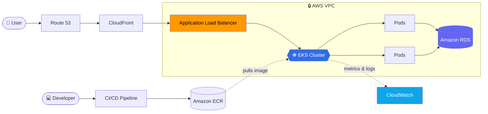

<!-- ============================== HEADER ============================== -->
<p align="center">
  
</p>

<p align="center">
  <a href="https://github.com/omamrute10">
    
  </a>
</p>

<p align="center">
  
</p>

<p align="center">
  <a href="mailto:omamrute10@gmail.com">
    
  </a>
  <a href="https://github.com/omamrute10">
    
  </a>
</p>

---

## 👨‍💻 About Me

```bash
om@cloud:~$ whoami
> Om Amrute — TY BSc Cloud Computing student & aspiring Cloud / DevOps Engineer

om@cloud:~$ cat focus.txt
> ☁️  Cloud       : AWS & Multi-Cloud
> ⚙️  DevOps      : Docker • Kubernetes • Terraform • CI/CD • Observability
> 🐧 Foundations : Linux • Networking • Security
> 🎯 Goal        : Build secure, scalable & automated cloud infrastructure

om@cloud:~$ echo $STATUS
> 🌱 Building practical cloud projects & learning every day
```

I enjoy designing cloud infrastructure, deploying applications, automating environments, and understanding how production systems are built and operated.

---

## 🚀 Featured Project

<table>
<tr>
<td>

### ☁️ Container Orchestration with Kubernetes using AWS

A cloud-native deployment project for running and managing containerized applications on **AWS EKS** — covering networking, load balancing, autoscaling, security and monitoring end to end.


**AWS services used:**
`EKS` `ECR` `EC2` `VPC` `ALB` `Route 53` `RDS` `CloudWatch` `CloudTrail` `IAM` `CloudFront` `S3` `EBS` `Auto Scaling`

<a href="https://github.com/omamrute10/Container-Orchestration-with-Kubernetes-using-AWS">
  
</a>

</td>
</tr>
</table>

### 🗺️ High-Level Flow



---

## 🛠️ Tech Stack

<p align="center">
  
</p>

<details open>
<summary><b>☁️ Cloud & Containers</b></summary>
<br>

| Area | Skills |
|------|--------|
| ☁️ **Cloud Platforms** | AWS (primary) • Azure • Google Cloud — multi-cloud core services |
| 🐳 **Containerization** | Docker, Dockerfiles, Images, Container Networking |
| ☸️ **Orchestration** | Kubernetes — Pods, Deployments, Services, Ingress, HPA, RBAC • Helm |

</details>

<details open>
<summary><b>⚙️ Automation & Delivery</b></summary>
<br>

| Area | Skills |
|------|--------|
| 🏗️ **Infrastructure as Code** | Terraform, AWS Infrastructure Provisioning |
| 🤖 **Config Management** | Ansible — Playbooks, Inventory, SSH Automation |
| 🔄 **CI/CD** | Jenkins, GitHub Actions |
| 🌿 **Version Control** | Git, GitHub, Branching, Repository Management |

</details>

<details open>
<summary><b>🐧 Systems, Networking & Observability</b></summary>
<br>

| Area | Skills |
|------|--------|
| 🐧 **Linux** | Administration, SSH, Processes, Filesystems, Permissions, Package Management |
| 🌐 **Networking** | IP Addressing, Subnets, Routing, DNS, Firewalls, Security Groups, VPC |
| 🔐 **Security** | IAM, RBAC, Security Fundamentals |
| 📈 **Monitoring** | CloudWatch, Prometheus & Grafana fundamentals |
| 🗄️ **Database** | MySQL, Amazon RDS |
| 💻 **Programming** | Python fundamentals, Bash/Shell scripting, HTML basics, Nginx |

</details>

---

## 📚 Currently Learning

<p align="center">
  
  
  
  
</p>

---

## 🎯 Career Goal

<p align="center">
  <i>"To become a Cloud / DevOps Engineer and build secure, scalable and automated cloud infrastructure."</i>
</p>

<p align="center">
  <code>Cloud Infrastructure</code> • <code>DevOps</code> • <code>Multi Cloud</code> • <code>Automation</code>
</p>

---


## 🤝 Let's Connect

<p align="center">
  Open to <b>internships</b>, <b>Entry-level jobs</b>
</p>

<p align="center">
  <a href="mailto:omamrute10@gmail.com">
    
  </a>
</p>

<p align="center">
  <b>☁️ Building in the cloud. ⚙️ Automating infrastructure. 🚀 Learning every day.</b>
</p>

<p align="center">
  
</p>
